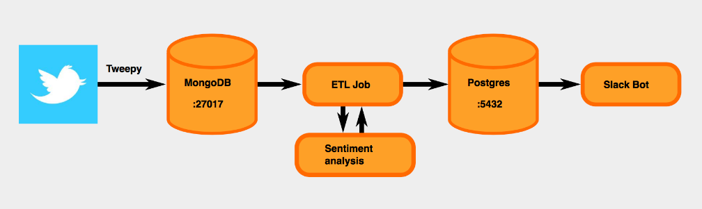

This aim of the project is to building a dockerized data pipeline that analyzes the sentiment of tweets. Five areas are being point of interest in order to complete the project  which are: 

1. `Tweet Collector`: Collection of tweets from twitter with help of twitter api.
2. `MongoDB`: Store the data into a relational database.
3. `ETL`: Clean the extracted data and analyze it for further operations.
4. `PostgresDB`: Extract stored data for slackbot app.
5. `Slackbot App`: Post the tweets with sentiment analysis score.

Each component will run in a separate docker container managed by `docker compose yaml` file. 

## Get twitter data
For tweet collection use `get_tweet.py` file. You will need to obtain twitter credentials at https://developer.twitter.com/en, register for an app and obtain the authentification tokens. Place the tokens generated by twitter api in the `config.py` file demonstrated as below:

App_name="..."

API_key="..."

API_Key_Secret="..."

Access_Token=""

Access_Token_Secret="..."

BEARER_TOKEN="..."

I have collected the tweets from The Guardian as `username = 'guardian'` twitter handle for my sentiment analysis. 
